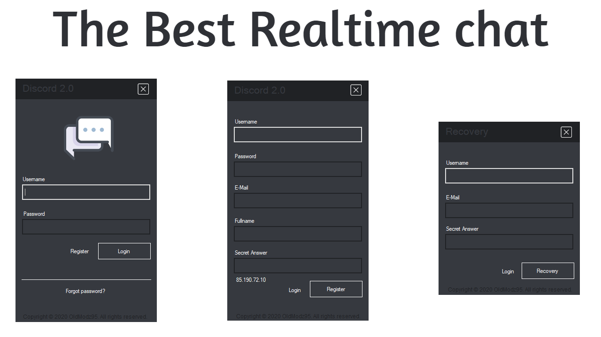
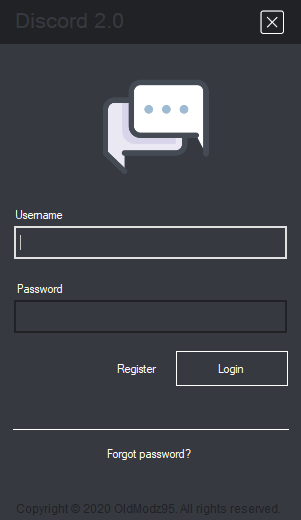
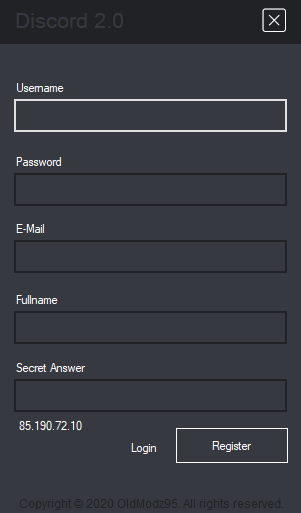
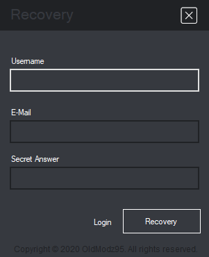
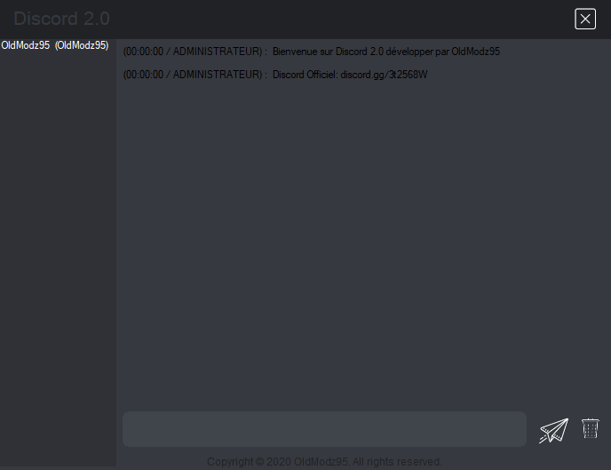

<h1 align="center">

OldModz95

</h1>
<p align="center">
  <a href="https://discord.gg/MS6TMgRfqB"></a>
</p>
<p align="center">
  <a href="https://discord.gg/M3sTyHtcK4"></a>
</p>

<br>

### Discord 2.0 - Real time chat -  By OldModz95 Proposed By ProtonDev
<br><br>



<br><br>

## REJOIGNIEZ LE SERVEUR DISCORD - JOIN SERVER DISCORD!!!!!!!!!!!!!!!!!!!!!!!!

https://discord.gg/MS6TMgRfqB
<br><br>

# 📝 Require
`mysql-connector-net-6.9.12`<br>
[Download Xampp](https://www.apachefriends.org/fr/index.html)<br>
[Download Wamp](https://www.wampserver.com/)

<br><br>

# 📥 Import DB

<br>

`localhost/phpmyadmin db-v1.0.sql`

<br>
<br>

## 🆙 Open Project

[Download Visual Studio (min 2019)](https://visualstudio.microsoft.com/fr/downloads/)<br>
--Package C#

<br><br>

## 🔧 Information

Target Framework: .NET Framework 4.5<br>
Language: C# Windows Form and SQL<br>

<br><br>

## 🔔 Connexion SQL

Form: `main.cs`<br>
Ligne: `24`<br>

Form: `login.cs` / `register.cs` / `Forgot.cs`<br>
Ligne: `23`

<br>
<br>

<br>

## 👁‍🗨 IMAGE

<br>

### Login

<br>

### Register

<br>

### Forgot password

<br>

### Main (chat/user online)

<br>
<br>

# FRANCAIS
```
Je ne fournirais aucun support sur son fonctionnement et la mise en place de cette source.
Cette source date de début 2021 sorti dans la boutique ProtonDev.
Décidé de rendre tout projet gratuit.

Cette source est proteger par sont développeur.
Ce qui veux dire, que vous avez aucun droit de re-publié sa source ou de l'utiliser à des fin commercial.
```

<br>
<br>

# ENGLISH
```
I would not provide any support on how it works and how to set up this source.
This source is from early 2021 released in the ProtonDev store.
Decided to make any project free.

This source is copyrighted by its developer.
Meaning, you have no right to republish its source or use it for commercial purposes.
```

<br>
<br><br>


## 📞 Contact me

[Discord](https://www.discord.gg/MS6TMgRfqB)
[Twitter](https://twitter.com/oldmodz95)
<br>

<br />

## 🔧 Technologies & Tools


###### Version control system


###### License


###### Operating systems


## &#x1f4c8; GitHub Stats

<a href="https://github.com/OldModz95-YTB">
  
</>
<a href="https://github.com/OldModz95-YTB">
  
</a>

<p align="left">  </p>
